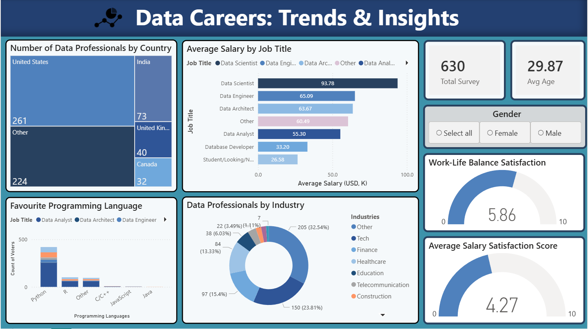

# 📊 Data Careers: Trends & Insights
### An Interactive Power BI Dashboard Built on Real-World Survey Data

---

## 🔍 Project Overview

This project leverages a real-world survey dataset of **630+ data professionals** to uncover insights regarding salary trends, job satisfaction, and industry demographics within the data industry. Raw survey responses were transformed into a fully interactive Power BI dashboard to help identify key patterns across the data profession.

---

## 🎯 Objective

- Analyze how **salary correlates with job title**
- Identify the most **popular programming languages** among data professionals
- Understand **job satisfaction** across salary and work-life balance dimensions
- Explore **geographic and industry distribution** of data professionals
- Create **an interactive analytics dashboard** for exploration

---

## 📁 Dataset Description

| Attribute | Details |
|---|---|
| **Source** | Real-world survey collected via LinkedIn & Twitter |
| **Records** | 630+ data professionals |
| **Demographics** | Age, Gender, Country |
| **Professional Info** | Job Title, Industry, Salary Range, Programming Language |
| **Psychographic Data** | Job satisfaction ratings (0–10 scale) |

---

## 🛠️ Tools & Technologies

| Tool | Purpose |
|---|---|
| **Power BI Desktop** | Core platform for visualization & dashboard creation |
| **Power Query Editor** | Data cleaning, transformation & average salary calculation |
| **Microsoft Excel** | Initial data exploration & CSV handling |

---

## 📊 Dashboard Features & Visuals

| Visual | Description |
|---|---|
| **KPI Cards** | Total survey count (630) and average respondent age (29.87) |
| **Clustered Bar Chart** | Average Salary by Job Title — compares earnings across roles |
| **Clustered Column Chart** | Favourite Programming Languages by job title |
| **Tree Map** | Number of Data Professionals by Country |
| **Pie Chart** | Data Professionals by Industry distribution (%) |
| **Gauge Charts** | Work-Life Balance Satisfaction (5.86/10) & Salary Satisfaction Score (4.27/10) |
| **Gender Slicer** | Interactive filter applied across **all visuals** to compare metrics across Male/Female respondents |
| **Education Level Filter** | Available via the **Filters pane** to explore how academic background (High School, Bachelors, Masters, PhD) influences salary and satisfaction |

---

## 💡 Key Insights & Findings

- 🥇 **Data Scientists** command the highest average salary at **$93.78K**, followed by Data Engineers at $65.09K
- 🐍 **Python** is the dominant programming language across all data roles
- 😐 **Salary satisfaction is low** — averaging only **4.27 out of 10**, suggesting compensation dissatisfaction is widespread
- ⚖️ **Work-Life Balance** scores slightly better at **5.86 out of 10**
- 🌍 The **United States** leads with 261 respondents, followed by Other regions (224), India (73), United Kingdom (40), and Canada (32)
- 🏭 **Other industries (32.54%)** and **Tech (23.81%)** dominate the respondent pool, followed by Finance (15.4%)
- 👥 The **Gender Slicer** enables comparison of salary and satisfaction trends between male and female professionals
- 🎓 **Education Level** filtering via the Filters pane enables exploration of how academic background (High School, Bachelors, Masters, PhD) influences salary and satisfaction across the data field

---

## 🔄 Steps Followed to Build This Project

1. **Data Extraction** — Imported the raw survey CSV file into Power BI Desktop
2. **Data Transformation (Power Query)**
   - Split columns by delimiters to normalize job titles and programming languages
   - Cleaned salary column: removed text characters (K, +, −) and calculated a numerical **Average Salary** column
   - Changed data types to ensure all numerical fields were ready for aggregation
3. **Data Visualization** — Built all interactive charts and configured filter context using the Gender slicer
4. **Dashboard Theming** — Applied a custom navy blue color scheme for visual consistency and professional appearance

---

## ✅ Skills Demonstrated

- **Data Wrangling** — Power Query proficiency to handle messy real-world data
- **DAX & Calculations** — Custom column calculations to derive averages from salary ranges
- **Data Visualization Design** — Dashboard layout best practices and interactivity
- **Analytical Thinking** — Converting raw survey feedback into actionable professional insights

---

## 📸 Dashboard Preview

> The dashboard includes an interactive **Gender slicer** applied across **all visuals simultaneously**. Additionally, **Education Level** filtering is available via the **Filters pane**, enabling deeper exploration of how academic background influences career trends.

---

## 👤 Author

**MH. Ahmed Haseen**
| Data Analyst | Data Science Enthusiast

---

## 📌 How to Use

1. Download or clone this repository
2. Open the `.pbix` file using **Power BI Desktop**
3. Use the **Gender slicer** on the dashboard to filter all visuals, and the **Filters pane** to filter by Education Level
4. Hover over charts for detailed tooltips and data points

---

*⭐ If you found this project useful or insightful, feel free to star this repository!*